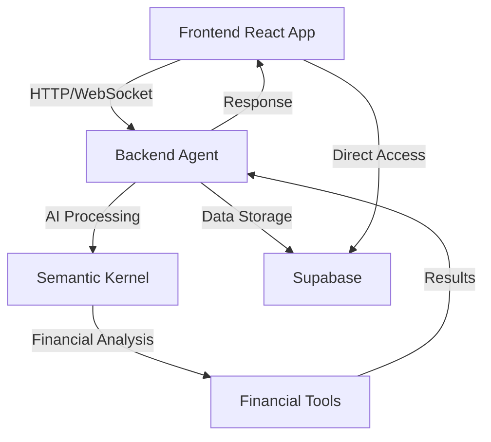
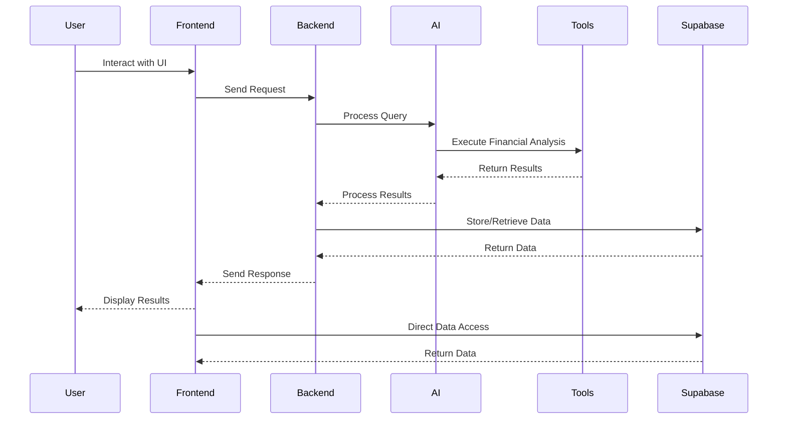
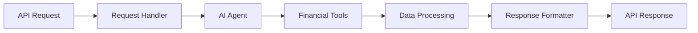
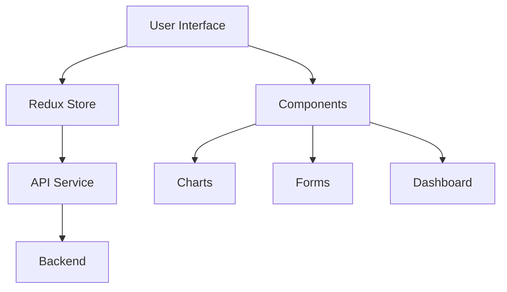

# Personal Finance Agent

A comprehensive personal finance management system with an AI-powered agent and modern web interface.

## Project Overview

This project consists of two main components:

1. **Backend Agent** (`agent-finance-personal/`): A Python-based AI agent that handles financial analysis and recommendations
2. **Frontend Application** (`app-finance-personal/`): A modern React-based web interface for interacting with the financial agent

## Contributors

### Core Team

- [Joseph Esteban](https://github.com/jesteban19) - Lead Developer & Project Architect
- [Snayder Esteban](https://github.com/snayderesteban) - Frontend Developer & UI/UX Designer

### How to Contribute

We welcome contributions from the community! Here's how you can help:

1. Fork the repository
2. Create a feature branch (`git checkout -b feature/amazing-feature`)
3. Commit your changes (`git commit -m 'Add some amazing feature'`)
4. Push to the branch (`git push origin feature/amazing-feature`)
5. Open a Pull Request

### Code of Conduct

Please read our [Code of Conduct](CODE_OF_CONDUCT.md) before contributing.

### Pull Request Process

1. Update the README.md with details of changes if needed
2. Update the documentation
3. The PR will be reviewed by at least one core team member
4. Once approved, it will be merged into the main branch

### System Architecture



### Data Flow



## Backend Features

The backend agent is built using:

- Python 3.12+
- Quart (async web framework)
- Semantic Kernel for AI capabilities
- Chainlit for agent interactions
- Hypercorn for ASGI server

### Agent Capabilities

- Financial analysis and recommendations
- Natural language processing for user queries
- Integration with various financial data sources
- Secure API endpoints for frontend communication

### Backend Flow



## Frontend Features

The frontend is built with modern web technologies:

- React 19
- TypeScript
- TailwindCSS for styling
- Redux for state management
- Chart.js for data visualization
- React Router for navigation

### Key Features

- Interactive financial dashboards
- Real-time data visualization
- Speech recognition capabilities
- Markdown support for rich text
- Responsive design
- Modern UI components

### Frontend Architecture



## Installation

### Prerequisites

- Python 3.12 or higher
- Node.js 18 or higher
- Poetry (Python package manager)
- npm or yarn

### Backend Setup

1. Navigate to the backend directory:

   ```bash
   cd agent-finance-personal
   ```

2. Install Python dependencies:

   ```bash
   poetry install
   ```

3. Create a `.env` file based on `.env_test`:

   ```bash
   cp .env_test .env
   ```

4. Start the backend server:
   ```bash
   poetry run start
   ```

### Frontend Setup

1. Navigate to the frontend directory:

   ```bash
   cd app-finance-personal
   ```

2. Install JavaScript dependencies:

   ```bash
   npm install
   ```

3. Start the development server:
   ```bash
   npm run dev
   ```

## Running the Application

1. Start the backend server (from `agent-finance-personal` directory):

   ```bash
   poetry run start
   ```

2. Start the frontend development server (from `app-finance-personal` directory):

   ```bash
   npm run dev
   ```

3. Access the application at `http://localhost:5173`

## Development

- Backend runs on `http://localhost:8000`
- Frontend runs on `http://localhost:5173`
- API documentation is available at `http://localhost:8000/docs`

## Contributing

1. Fork the repository
2. Create a feature branch
3. Commit your changes
4. Push to the branch
5. Create a Pull Request

## License

This project is licensed under the MIT License - see the LICENSE file for details.
